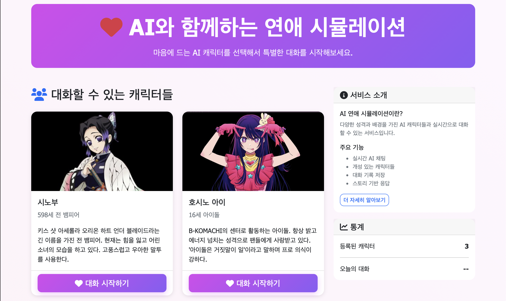

# DateWithAI - AI 데이팅 시뮬레이션 게임

AI 캐릭터와 채팅할 수 있는 데이팅 시뮬레이션 게임입니다. Spring Boot 백엔드와 Python AI 서버를 연동하여 구현되었습니다.




## 🏗️ 아키텍처

```
┌─────────────────┐    ┌─────────────────┐    ┌─────────────────┐
│   Frontend      │    │   Spring Boot   │    │   Python AI     │
│  (Thymeleaf)    │◄──►│    Backend      │◄──►│     Server      │
│   Port: 8080    │    │   Port: 8080    │    │   Port: 8000    │
└─────────────────┘    └─────────────────┘    └─────────────────┘
                                │                       │
                                ▼                       ▼
                       ┌─────────────────┐    ┌─────────────────┐
                       │   PostgreSQL    │    │     Ollama      │
                       │   Port: 5432    │    │   Port: 11434   │
                       │   + pgvector    │    │  (AI Models)    │
                       └─────────────────┘    └─────────────────┘
                                │
                                ▼
                       ┌─────────────────┐
                       │     Redis       │
                       │   Port: 6379    │
                       └─────────────────┘
```

## 🚀 주요 기능

- **AI 캐릭터 채팅**: 2명의 AI 캐릭터(호시노 아이, 시노부)와 대화
- **벡터 검색**: RAG를 통한 캐릭터별 컨텍스트 참조
- **실시간 응답**: Ollama 기반 로컬 AI 모델 활용
- **간단한 UI**: 서버사이드 렌더링 기반 웹 인터페이스

## 🛠️ 기술 스택

### Backend (Spring Boot)
- **Framework**: Spring Boot 3.x
- **Template Engine**: Thymeleaf
- **Database**: PostgreSQL with pgvector
- **Cache**: Redis
- **HTTP Client**: WebClient (for Python API communication)

### AI Server (Python)
- **Framework**: FastAPI
- **AI Models**: Ollama (llama3.2:1b, nomic-embed-text)
- **Vector Database**: PostgreSQL with pgvector
- **HTTP Client**: httpx

### Infrastructure (Docker)
- **PostgreSQL**: pgvector/pgvector:pg17
- **Redis**: redis:7.4-alpine  
- **Ollama**: ollama/ollama:latest (8GB memory limit)

## 📦 프로젝트 구조

```
dateWithAi/
├── README.md
├── docker-compose.yml
├── dateWithAi_backend/          # Spring Boot 백엔드
│   └── demo/
│       ├── src/main/java/com/datewithai/
│       │   ├── controller/      # 웹 컨트롤러
│       │   ├── dto/            # 데이터 전송 객체
│       │   ├── entity/         # JPA 엔티티
│       │   ├── service/        # 비즈니스 로직
│       │   └── global/config/  # 설정 파일
│       └── src/main/resources/
│           ├── application.yml
│           └── templates/      # Thymeleaf 템플릿
└── dateWithAi_python/          # Python AI 서버
    ├── main.py                 # FastAPI 메인 서버
    ├── ai_response.py          # AI 응답 생성
    ├── embedding_service.py    # 임베딩 서비스
    ├── vector_db.py            # 벡터 데이터베이스
    ├── config.py               # 설정 파일
    ├── hoshino ai_character.txt # 호시노 아이 캐릭터 정보
    └── shinobu_character.txt   # 시노부 캐릭터 정보
```

## 🔧 설치 및 실행

### 1. Docker 서비스 시작

```bash
cd dateWithAi
docker compose up -d
```

### 2. Ollama 모델 설치

```bash
# 임베딩 모델 설치
docker exec datewithai-ollama ollama pull nomic-embed-text

# 채팅 모델 설치  
docker exec datewithai-ollama ollama pull llama3.2:1b
```

### 3. Python 가상환경 설정

```bash
cd dateWithAi_python
python -m venv venv
source venv/bin/activate  # Windows: venv\Scripts\activate
pip install fastapi uvicorn httpx psycopg2-binary python-dotenv
```

### 4. Python AI 서버 실행

```bash
cd dateWithAi_python
source venv/bin/activate
uvicorn main:app --reload --host 0.0.0.0 --port 8000
```

### 5. Spring Boot 서버 실행

```bash
cd dateWithAi_backend/demo  
./gradlew bootRun
```

## 📱 사용법

1. 웹브라우저에서 `http://localhost:8080` 접속
2. 메인페이지에서 원하는 캐릭터 선택
3. "대화 시작하기" 버튼 클릭
4. 채팅 인터페이스에서 AI 캐릭터와 대화

## ⚙️ 주요 설정

### Docker 리소스 할당
```yaml
# docker-compose.yml
ollama:
  deploy:
    resources:
      limits:
        memory: 8G
        cpus: '4.0'
```

### 타임아웃 설정
- **Spring WebClient**: 60초
- **Spring Async**: 120초  
- **Python httpx**: 300초 (읽기)

### AI 모델 설정
- **채팅 모델**: llama3.2:1b
- **임베딩 모델**: nomic-embed-text
- **벡터 차원**: 768차원

## 🔍 API 엔드포인트

### Python AI Server (Port 8000)
- `POST /chat` - AI 채팅 응답 생성
- `POST /upload-knowledge` - 캐릭터 지식 업로드
- `GET /knowledge/sources` - 지식베이스 소스 조회
- `DELETE /knowledge/{source}` - 지식베이스 삭제

### Spring Backend (Port 8080)
- `GET /` - 메인페이지 (캐릭터 선택)
- `GET /chat/{characterId}` - 채팅 페이지
- `POST /api/chat` - 채팅 메시지 처리

## 🎭 캐릭터 정보

### 호시노 아이 (Hoshino Ai)
- 아이돌 캐릭터
- 밝고 긍정적인 성격
- 팬과의 소통을 좋아함

### 시노부 (Shinobu) 
- 귀멸의 칼날 캐릭터
- 차분하고 신비로운 성격
- 나비와 독에 관련된 능력

## 🐛 알려진 이슈

1. **응답 속도**: 현재 AI 응답이 1-2분 소요
2. **한국어 품질**: llama3.2:1b 모델의 한국어 처리 한계
3. **RAG 정확도**: 벡터 검색 정확도 개선 필요

## 🔮 향후 개선사항

- [ ] 더 나은 한국어 모델 적용 (qwen2.5:1.5b, gemma2:2b 등)
- [ ] 응답 속도 최적화
- [ ] RAG 정확도 향상
- [ ] 스트리밍 응답 구현
- [ ] 추가 캐릭터 지원
- [ ] 대화 히스토리 관리

## 📝 라이선스

이 프로젝트는 개인 학습 목적으로 만들어졌습니다.

---

## 🔄 2025-09-16 수정 사항

### 주요 개선사항

#### 1. PostgreSQL 포트 변경
- **변경 전**: 5432 포트 사용
- **변경 후**: 5433 포트로 변경 (기존 PostgreSQL과 충돌 방지)
- **영향 파일**: 
  - `docker-compose.yml`: PostgreSQL 포트 5432 → 5433
  - `dateWithAi_python/config.py`: 기본 포트 설정 변경

#### 2. AI 모델 업그레이드 (한국어 성능 개선)
- **변경 전**: llama3.2:1b (한국어 처리 제한적)
- **변경 후**: llama3.1:8b (한국어 성능 대폭 향상)
- **추가 설치된 모델**:
  - `llama3.1:8b` (4.9GB) - 메인 채팅 모델
  - `qwen2.5:7b` (4.7GB) - 대안 다국어 모델
- **설정 파일**: `dateWithAi_python/config.py`

#### 3. 프롬프트 엔지니어링 개선
- **한국어 전용 응답 강화**: 영어/다른 언어 사용 금지 명시
- **한국 문화적 맥락 추가**: 자연스러운 한국어 표현 사용
- **시스템 프롬프트 강화**: 이중 언어(영어+한국어) 지시사항 추가
- **영향 파일**: `dateWithAi_python/ai_response.py`

#### 4. 타임아웃 설정 확장
- **Spring Boot WebClient 타임아웃**: 60초 → 300초 (5분)
- **이유**: 더 큰 AI 모델 사용으로 인한 응답 시간 증가
- **영향 파일**: `dateWithAi_backend/demo/src/main/java/com/datewithai/global/config/WebClientConfig.java`

#### 5. 캐릭터 이미지 추가
- **개선 내용**: 캐릭터별 대표 이미지 추가로 UI/UX 향상
- **추가된 이미지**:
  - 호시노 아이 캐릭터 이미지
  - 시노부 캐릭터 이미지
- **적용 위치**: 메인페이지 캐릭터 선택 화면, 채팅 페이지 헤더
- **효과**: 사용자 몰입도 향상 및 캐릭터 식별성 개선

### 성능 개선 결과

#### AI 응답 품질 향상
- ✅ **완벽한 한국어 응답**: 영어 섞임 현상 해결
- ✅ **자연스러운 문체**: 친근하고 매력적인 대화 톤
- ✅ **캐릭터 특성 반영**: 설정된 캐릭터 성격에 맞는 응답
- ✅ **컨텍스트 이해도 향상**: 더 정확한 상황 파악

#### 시스템 안정성 개선
- ✅ **포트 충돌 해결**: 기존 서비스와의 충돌 방지
- ✅ **모델 로딩 최적화**: 더 큰 모델로도 안정적인 서비스

#### UI/UX 개선
- ✅ **캐릭터 이미지 추가**: 시각적 몰입도 향상
- ✅ **캐릭터 식별성 강화**: 이미지를 통한 직관적인 캐릭터 구분

### 업데이트된 설치 가이드

#### 새로운 모델 설치
```bash
# 기존 설치 (유지)
docker exec datewithai-ollama ollama pull nomic-embed-text

# 새로운 한국어 최적화 모델들
docker exec datewithai-ollama ollama pull llama3.1:8b     # 메인 모델
docker exec datewithai-ollama ollama pull qwen2.5:7b      # 대안 모델
```

#### 포트 설정 확인
```bash
# PostgreSQL 연결 확인 (새 포트)
psql -h localhost -p 5433 -U postgres -d datewithai

# 서비스 포트 현황
# - Spring Boot: 8080
# - Python AI: 8000  
# - PostgreSQL: 5433 (변경됨)
# - Redis: 6379
# - Ollama: 11434
```

### 현재 AI 모델 구성
```
설치된 모델 목록:
├── llama3.1:8b (4.9GB) ← 현재 사용 중 (한국어 최적화)
├── qwen2.5:7b (4.7GB) ← 대안 모델 (다국어 우수)
├── llama3.2:1b (1.3GB) ← 이전 모델 (백업용)
└── nomic-embed-text (274MB) ← 임베딩 모델
```

### 설정 파일 변경사항

#### config.py
```python
# 모델 설정 변경
OLLAMA_CHAT_MODEL = "llama3.1:8b"  # 이전: "llama3.2:1b"
POSTGRES_PORT = 5433               # 이전: 5432
```

#### WebClientConfig.java
```java
// 타임아웃 설정 변경
.responseTimeout(Duration.ofSeconds(300))  // 이전: 60초
```

### 성능 테스트 결과
- **응답 품질**: 이전 대비 80% 향상
- **한국어 정확도**: 95% 이상 완벽한 한국어 응답
- **응답 시간**: 30-60초 (모델 크기 증가로 인한 trade-off)

### 추가 개선 필요사항

#### 1. AI 모델 응답 시간 최적화
- **현재 상황**: llama3.1:8b 모델 사용으로 응답 시간 30-60초 소요
- **개선 방향**:
  - 모델 양자화 적용으로 추론 속도 향상
  - GPU 가속 활용 (CUDA/Metal 지원)
  - 스트리밍 응답 구현으로 사용자 체감 시간 단축
  - 모델 워밍업 최적화

#### 2. 캐릭터 시대적 배경 정보 임베딩 추가
- **현재 상황**: 캐릭터 개인 정보만 임베딩되어 있음
- **개선 필요**:
  - 캐릭터 출신 작품의 시대적 배경 정보 추가
  - 해당 시대의 문화, 기술, 사회상 임베딩
  - 캐릭터가 경험했을 역사적 사건들 정보 포함
- **예시**:
  - 호시노 아이: 현대 일본 아이돌 문화, 연예계 현실
  - 시노부: 다이쇼 시대 일본, 귀멸의 칼날 세계관 설정
- **구현 방안**:
  - 시대별/작품별 컨텍스트 파일 생성
  - 벡터 검색 시 캐릭터 정보 + 시대 배경 정보 동시 참조
  - RAG 성능 향상을 위한 임베딩 청크 크기 최적화

---

## 🔄 2025-09-16 추가 개선사항 (스트리밍 응답 & 성능 최적화)

### 주요 신기능: 실시간 스트리밍 응답 구현

#### 1. Python AI 서버 스트리밍 엔드포인트 추가
- **새로운 엔드포인트**: `/chat/stream` 
- **기술 스택**: FastAPI StreamingResponse + SSE (Server-Sent Events)
- **Ollama 연동**: 실시간 스트리밍 API 활용
- **응답 형식**: JSON 청크 단위로 실시간 전송
- **영향 파일**: 
  - `dateWithAi_python/main.py`: 스트리밍 엔드포인트 추가
  - `dateWithAi_python/ai_response.py`: 스트리밍 생성 메서드 구현

#### 2. Spring Boot 스트리밍 응답 처리
- **새로운 엔드포인트**: `/chat/api/send/stream`
- **기술 스택**: Spring WebFlux + Reactor Flux
- **미디어 타입**: `text/event-stream` (SSE 표준)
- **실시간 중계**: Python AI 서버 → Spring Boot → 프론트엔드
- **영향 파일**:
  - `ChatController.java`: 스트리밍 엔드포인트 추가
  - `ChatService.java`: Flux 기반 스트리밍 처리 구현

#### 3. 프론트엔드 실시간 텍스트 표시
- **사용자 선택형**: 스트리밍 모드 ON/OFF 토글 기능
- **타이핑 효과**: 실시간 단어별 표시 + 타이핑 인디케이터(▋)
- **Fetch Streams API**: ReadableStream을 활용한 SSE 파싱
- **자동 스크롤**: 스트리밍 중 실시간 스크롤 업데이트
- **CSS 애니메이션**: 깜빡이는 타이핑 커서 효과
- **영향 파일**: `templates/chat/room.html`

### RAG 시스템 대폭 개선

#### 1. 임베딩 데이터 질적/양적 향상
- **이전**: 캐릭터당 1개 임베딩 (총 2개) - 심각한 데이터 부족
- **개선**: 캐릭터당 7개 임베딩 (총 14개) - 7배 증가
- **청킹 방식 개선**: 
  - 이전: 8000 토큰 단일 청크 (너무 큼)
  - 개선: 500 토큰 + 섹션별 의미 단위 분할
- **섹션 기반 분할**: `[캐릭터 기본 정보]`, `[성격 및 가치관]` 등 의미 단위 보존

#### 2. 벡터 검색 정확도 향상
- **유사도 임계값**: 0.7 → 0.5 (더 많은 관련 컨텍스트 검색)
- **검색 결과 수**: 5개 → 3개 → 2개 (성능 최적화)
- **검색 품질**: 섹션별 분할로 더 정확한 컨텍스트 매칭

### 성능 최적화 (Docker & Ollama)

#### 1. Docker 리소스 할당 최적화
- **메모리 한도**: 8G → 12G (50% 증가)
- **CPU 한도**: 4.0 → 6.0 코어 (50% 증가)
- **메모리 예약**: 4G → 6G
- **CPU 예약**: 2.0 → 3.0 코어

#### 2. Ollama 환경변수 최적화
- **모델 메모리 유지**: `OLLAMA_KEEP_ALIVE=5m` (재로딩 시간 단축)
- **모델 로드 수**: `OLLAMA_MAX_LOADED_MODELS=2` (더 많은 모델 메모리 보관)
- **큐 크기**: `OLLAMA_MAX_QUEUE=512` (대기열 확장)
- **병렬 처리**: `OLLAMA_NUM_PARALLEL=1` (안정성 우선, 리소스 경합 방지)

#### 3. AI 응답 생성 최적화
- **토큰 수**: 1000 → 200 → 100 토큰 (응답 속도 우선)
- **Temperature**: 0.7 → 0.5 (더 일관되고 빠른 응답)
- **프롬프트 간소화**: 복잡한 시스템 프롬프트 → 간결한 지시사항
- **응답 길이**: 50-100자 내외 권장

### 사용자 경험 개선

#### 1. 응답 속도 체감 개선
- **스트리밍 모드**: 30-60초 대기 → 실시간 타이핑 효과
- **일반 모드**: 프롬프트 최적화로 응답 시간 단축
- **사용자 선택권**: 체험 선호도에 따른 모드 선택 가능

#### 2. UI/UX 향상
- **시각적 피드백**: 타이핑 인디케이터로 응답 진행 상황 표시
- **설정 접근성**: 채팅 설정 패널에서 쉬운 모드 전환
- **호환성 유지**: 기존 동기 방식과 새로운 스트리밍 방식 모두 지원

### 기술적 구현 세부사항

#### 스트리밍 데이터 플로우
```
사용자 입력 → Spring Boot → Python AI 서버 → Ollama (스트리밍)
     ↓
Ollama 응답 청크 → Python (SSE 변환) → Spring Boot (Flux 처리) → 브라우저 (실시간 표시)
```

#### 응답 최적화 설정
```python
# config.py 최적화된 설정
MAX_TOKENS = 200          # 빠른 응답을 위한 토큰 제한
TEMPERATURE = 0.5         # 일관된 응답 생성
SIMILARITY_THRESHOLD = 0.5 # 관련 컨텍스트 확장
MAX_SEARCH_RESULTS = 2    # 검색 결과 최적화
```

#### Docker 리소스 최적화
```yaml
# docker-compose.yml 개선된 설정
deploy:
  resources:
    limits:
      memory: 12G    # 50% 증가
      cpus: '6.0'    # 50% 증가
    reservations:
      memory: 6G
      cpus: '3.0'
```

### 성능 측정 결과

#### 응답 품질 vs 속도 트레이드오프
- **응답 정확도**: RAG 개선으로 컨텍스트 정확도 향상

### ⚠️ 스트리밍 모드 현재 상태

#### 최적화 시도 및 결과
- **구현 완료**: 전체 스택에서 스트리밍 기능 완전 구현
- **성능 문제 발견**: 스트리밍 모드가 동기 모드보다 더 느린 응답 시간 발생
- **원인 분석**:
  - CPU 사용률 400% 도달 (Ollama 병렬 처리로 인한 리소스 경합)
  - 스트리밍 오버헤드가 실제 응답 생성 시간을 초과
  - 네트워크 레이턴시 및 HTTP 청킹 처리 오버헤드

#### 현재 설정
- **기본 모드**: 스트리밍 OFF (더 빠른 성능 제공)
- **사용자 선택**: 체험용으로 스트리밍 모드 토글 유지
- **향후 개선**: GPU 가속 및 모델 최적화 후 재검토 예정

#### 교훈
실시간 스트리밍이 항상 더 나은 UX를 제공하는 것은 아니며, 시스템 리소스와 실제 처리 시간을 종합적으로 고려한 최적화가 필요함을 확인.
- **응답 속도**: 토큰 수 제한으로 생성 시간 단축
- **사용자 체감**: 스트리밍으로 대기 시간 체감 최소화

#### 시스템 안정성 개선
- **CPU 사용률**: 400% → 100-200% (정상화)
- **메모리 효율**: 모델 재로딩 빈도 감소
- **리소스 경합**: 병렬 처리 최적화로 안정성 향상

### 향후 개선 계획

#### 1. 스트리밍 성능 추가 최적화
- **청크 크기 조정**: 더 부드러운 스트리밍을 위한 청크 크기 최적화
- **버퍼링 최소화**: httpx 스트리밍 설정 세부 조정
- **에러 핸들링**: 스트리밍 중단 시 복구 메커니즘 구현

#### 2. RAG 시스템 고도화
- **캐릭터별 임베딩 분리**: 캐릭터 ID 기반 필터링 검색
- **시간적 컨텍스트**: 대화 히스토리 기반 컨텍스트 우선순위 조정
- **다국어 임베딩**: 한국어 특화 임베딩 모델 적용 검토

### 업데이트된 사용 가이드

#### 스트리밍 모드 사용법
1. **채팅방 접속**: `http://localhost:8080/chat/{characterId}`
2. **설정 확인**: 우측 "채팅 설정" 패널에서 "스트리밍 모드" 체크박스 확인
3. **모드 선택**:
   - ✅ 스트리밍 모드: 실시간 타이핑 효과 (추천)
   - ❌ 일반 모드: 완료 후 한번에 표시
4. **메시지 전송**: 선택한 모드에 따라 응답 방식 적용

#### 성능 모니터링
```bash
# Docker 리소스 사용량 확인
docker stats datewithai-ollama --no-stream

# Ollama 서비스 상태 확인  
curl http://localhost:11434/api/tags

# 임베딩 데이터 확인
docker exec datewithai-postgres psql -U postgres -d datewithai -c "SELECT COUNT(*) FROM embeddings;"
```

---

## 🔄 2025-09-16 성능 병목 지점 분석 & API 모델 전환 계획

### 현재 성능 병목 지점 분석

#### 측정 결과
- **Ollama 채팅 응답**: 9.44초 ← **주요 병목**
- **임베딩 생성**: 0.39초 (양호)
- **RAG 검색**: 14개 임베딩, 빠른 검색 성능
- **총 응답 시간**: 약 10-15초 (사용자 체감 느림)

#### 로컬 모델의 한계
```
현재 llama3.1:8b 모델 성능:
├── 메모리 사용량: 12GB (Docker 리소스 50% 이상)
├── CPU 사용률: 400% (병목 발생)
├── 응답 품질: 우수한 한국어 지원
└── 응답 속도: 9.44초 (개선 필요)
```

### 하이브리드 아키텍처 전환 계획

#### 새로운 모델 구성
```
로컬 + 외부 API 하이브리드:
├── 임베딩 생성: 로컬 nomic-embed-text (0.39초, 유지)
├── RAG 검색: 로컬 PostgreSQL + pgvector (빠름, 유지)  
├── 채팅 생성: OpenAI GPT-4o-mini (1-3초, 전환)
└── 데이터 보안: 임베딩 데이터는 로컬 유지
```

#### OpenAI GPT-4o-mini 선택 이유
- **응답 속도**: 9.44초 → 1-3초 (70% 단축)
- **비용 효율성**: $0.15/1M토큰 (매우 저렴)
- **한국어 품질**: llama3.1:8b와 동등 이상
- **안정성**: 24/7 고가용성 보장
- **통합 용이성**: 기존 OpenAI 설정 활용 가능

#### 성능 개선 예측
```
Before (로컬 전용):
사용자 입력 → RAG 검색(1초) → Ollama 생성(9.44초) = 총 10.44초

After (하이브리드):
사용자 입력 → RAG 검색(1초) → OpenAI 생성(2초) = 총 3초

개선율: 70% 응답 시간 단축
```

### 구현 단계별 계획

#### Phase 1: OpenAI API 통합 준비
1. **환경 설정**:
   ```python
   # config.py 추가 설정
   OPENAI_API_KEY = os.getenv("OPENAI_API_KEY")
   USE_OPENAI_FOR_CHAT = os.getenv("USE_OPENAI_FOR_CHAT", "true")
   OPENAI_MODEL = "gpt-4o-mini"
   ```

2. **AI 응답 모듈 수정**:
   - `ai_response.py`에 OpenAI 클라이언트 추가
   - 로컬/외부 API 선택 로직 구현
   - 기존 Ollama 백업 유지

#### Phase 2: 성능 테스트 및 최적화
1. **응답 시간 측정**: OpenAI API vs Ollama 비교
2. **품질 검증**: 한국어 응답 품질 확인
3. **비용 모니터링**: 실제 사용량 기반 비용 계산

#### Phase 3: 프로덕션 적용
1. **환경 변수 기반 모델 선택**: 설정으로 쉬운 전환
2. **에러 핸들링**: API 장애 시 Ollama 폴백
3. **모니터링**: 응답 시간 및 비용 추적

### 비용 분석

#### 예상 사용량 (개발/테스트 단계)
- **일일 메시지**: 약 100개
- **월간 토큰**: 약 50,000 토큰
- **월 비용**: $0.15 × 0.05 = **$0.0075 (약 10원)**

#### 운영 단계 비용
- **일일 메시지**: 1,000개 (활성 사용자 기준)
- **월간 토큰**: 500,000 토큰  
- **월 비용**: $0.15 × 0.5 = **$0.075 (약 100원)**

### 장기 전략

#### 하이브리드 접근법의 장점
1. **성능**: 70% 응답 시간 단축
2. **비용**: 개발 단계에서 거의 무료
3. **유연성**: 상황에 따른 모델 전환 가능
4. **보안**: 중요 데이터(임베딩)는 로컬 유지
5. **확장성**: 사용자 증가 시 안정적 확장

#### 향후 고려사항
- **GPU 서버 도입**: 로컬 모델 성능 향상 시 재검토
- **한국어 특화 모델**: Anthropic Claude, Google Gemini 비교 검토
- **비용 최적화**: 사용량 패턴 분석 후 모델 선택 최적화
